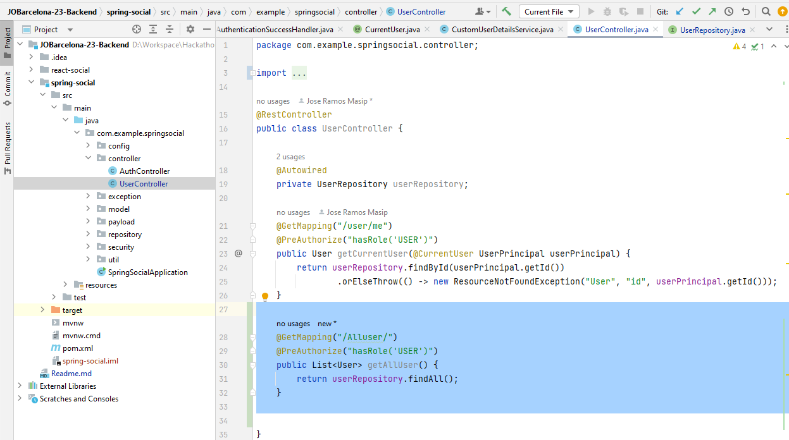

# GitHub social login implementation for JOBarcelona'23


https://user-images.githubusercontent.com/107991714/231402432-63608682-2f14-4af9-9c47-4d215b07abe3.mp4


## Funcionamiento Backend Server (spring-social)

+ **Crear MySQL database**

	```bash
	mysql> create database spring_social
	```

+ **Configurar usuario y contraseña de la base de datos**
+ 
	Tienes que poner la contraseña y nombre que tengas 
  + configurada en la base de datos de SQL. Yo recomiendo usar mySQL Workbench. 
  + En el application.yml del Gradle configurarlo así:
+ 
	```yml
	# spring-social/src/main/resources/application.yml
	spring:
	    datasource:
	        url: jdbc:mysql://localhost:3306/spring_social?useSSL=false
	        username: <TU_BASEDEDATOS_USERNAME>
	        password: <TU_BASEDEDATOS_PASSWORD>
	```

+ **Especificar OAuth2 Provider ClientId's y ClientSecrets**
	
	> Este paso no es necesario si lo estás configurando en localhost. Hay un demo clientId y clientSecret especificado.

	```yml
    security:
      oauth2:
        client:
          registration:
            google:
              clientId: <GOOGLE_CLIENT_ID>
              clientSecret: <GOOGLE_CLIENT_SECRET>
              redirectUriTemplate: "{baseUrl}/oauth2/callback/{registrationId}"
              scope:
                - email
                - profile
            facebook:
              clientId: <FACEBOOK_CLIENT_ID>
              clientSecret: <FACEBOOK_CLIENT_SECRET>
              redirectUriTemplate: "{baseUrl}/oauth2/callback/{registrationId}"
              scope:
                - email
                - public_profile
            github:
              clientId: <GITHUB_CLIENT_ID>
              clientSecret: <GITHUB_CLIENT_SECRET>
              redirectUriTemplate: "{baseUrl}/oauth2/callback/{registrationId}"
              scope:
                - user:email
                - read:user
          provider:
            facebook:
              authorizationUri: https://www.facebook.com/v3.0/dialog/oauth
              tokenUri: https://graph.facebook.com/v3.0/oauth/access_token
              userInfoUri: https://graph.facebook.com/v3.0/me?fields=id,first_name,middle_name,last_name,name,email,verified,is_verified,picture.width(250).height(250)
	```

	*Porfavor asegurate que `http://localhost:8080/oauth2/callback/<provider>`* esta autorizada como redirect uri en OAuth2 provider. Por ejemplo, en tu [Google API console](https://console.developers.google.com/projectselector/apis/credentials?pli=1), asegurate que `http://localhost:8080/oauth2/callback/google` está añadido en **Authorized redirect URIs**

	*Asegúrate también de que los alcances mencionados anteriormente se hayan agregado en la consola del proveedor de OAuth2.*	Por ejemplo, el scope email y profile deben agregarse en la pantalla de consentimiento de OAuth2 del proyecto de Google.

+ **Arrancar la API**
+ 
+ Puedes correr la API en tu IDE o ejecutar en terminal ("mvn" es maven comand):

	```bash
	mvn spring-boot:run
	```

## Arrancar el frontend

Entrar en la carpeta react-social (cd react-social) y ejecutar npm install para instalar dependencias y después ejecutar:

```bash
cd react-social
npm install && npm start
<<<<<<< HEAD
```


## Endpoint que muestre todos los usuarios registrados.

	Frontend no creado, de todos modos funciona en POSTMAN.
	El endpoint es http://localhost:3000/Alluser
	Aquí lo puedes ver en Java, es un findAll() del repositorio.



## Endpoint que permita dar "star" a un repositorio.

=======
```# JOBarcelona-23-Backend
# JOBarcelona-23-Backend
>>>>>>> 1f0e3881015d11bb52c5498e4ee935a5e0169e78
